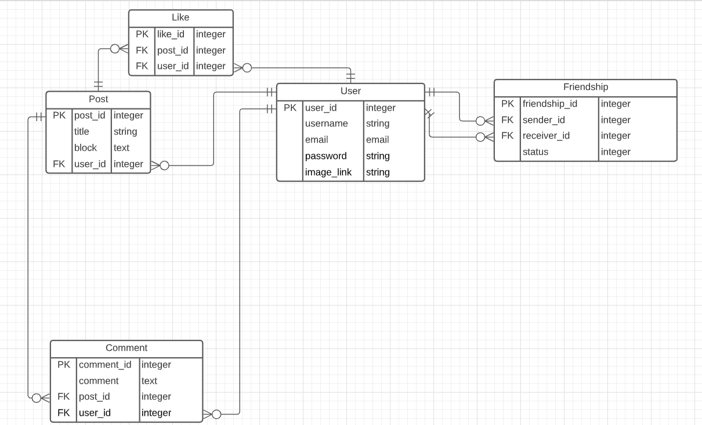
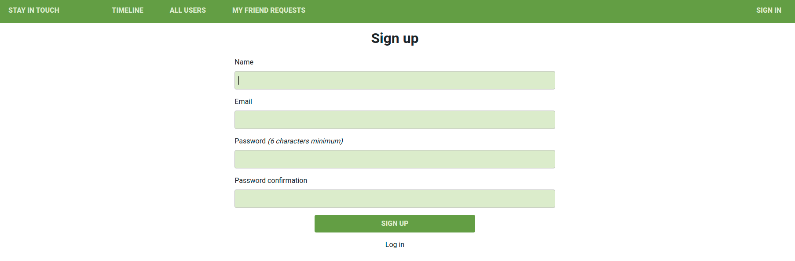
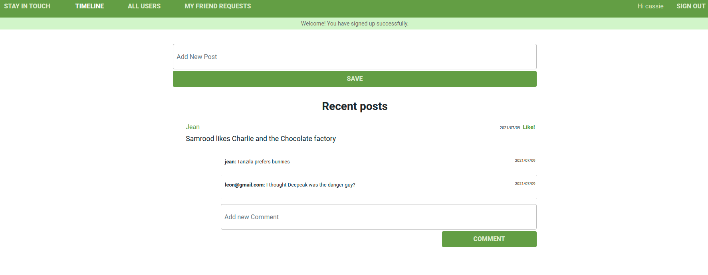
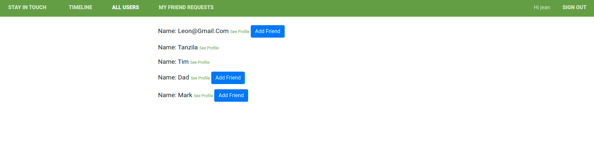
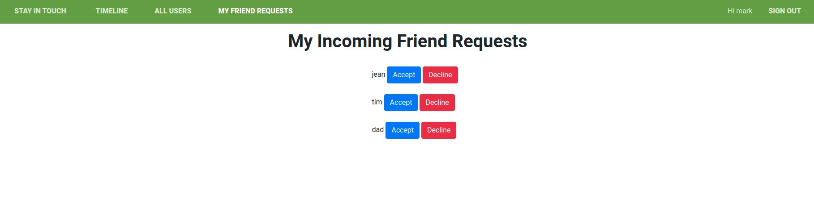

# Scaffold for social media app with Ruby on Rails

> This repo includes intial code for social media app with basic styling. Its purpose is to be a starting point for Microverse students.
Milestone 1 has been worked on adding the data architecture documentation with the Entity Relationship Diagram.

## Built With

- Ruby v2.7.0
- Ruby on Rails v5.2.4

## Getting Started

To get a local copy up and running follow these simple example steps.

### Prerequisites

Ruby: 2.6.3
Rails: 5.2.3
Postgres: >=9.5

### Setup

Instal gems with:

```
bundle install
```

Setup database with:

```
   rails db:create
   rails db:migrate
```

### Github Actions

To make sure the linters' checks using Github Actions work properly, you should follow the next steps:

1. On your recently forked repo, enable the GitHub Actions in the Actions tab.
2. Create the `feature/branch` and push.
3. Start working on your milestone as usual.
4. Open a PR from the `feature/branch` when your work is done.


### Usage

Start server with:

```
    rails server
```

Open `http://localhost:3000/` in your browser.

### Run tests

```
    rspec --format documentation
```

> Tests will be added by Microverse students. There are no tests for initial features in order to make sure that students write all tests from scratch.

### ERD documentation



### Project Runthrough
#### Sign Up
- A user firsts signs up following the guidance in the sign up form with a password of atleast 6 digits



#### Post Creation on Timeline
- You are then directed to a timeline page that shows all posts and gives you the provision to create a new post.



#### All Users, user profile and Add Friend button
- Click on the all Users page to see all the users. After clicking add friend, you cant click add friend again because the request has already been sent. The button disappears.



#### Pending Friend Requests, Accept or Decline
- Click on My Friend Requests to view all your incoming friend requests and either accept or decline them. After this, they are removed from that pending list.



## Author

👤 **Kaboha Jean Mark**

- GitHub: [@githubhandle](https://github.com/KabohaJeanMark)
- LinkedIn: [LinkedIn](https://www.linkedin.com/in/jean-mark-kaboha-software-engineer/)

## 🤝 Contributing

Contributions, issues and feature requests are welcome!

Feel free to check the [issues page](https://github.com/KabohaJeanMark/ror-social-scaffold/issues/).

## Show your support

Give a ⭐️ if you like this project!

## Acknowledgments

Hat tip to Microverse for the README template, initial repo, instructions and tutoring for this Capstone project.

## 📝 License

This project is [MIT](./LICENSE) licensed.

