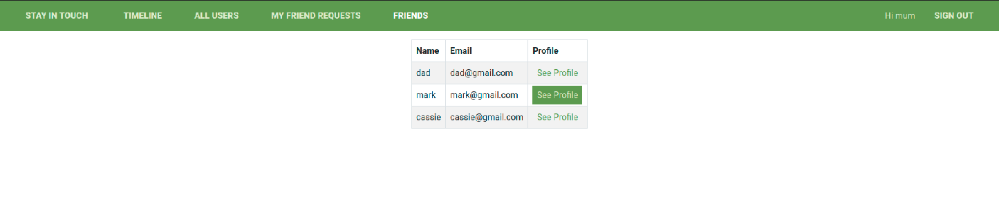

# Stay in Touch Social Media app with Ruby on Rails. 

> A full stack rails application of a friends social media website where users can send and receive friend requests and share posts with each other. It uses associations and through associations to create friendships and mutual friendships. The features are listed next to the screenshots.

## Live Demo

[Live Demo Link](https://sheltered-hamlet-43209.herokuapp.com/)

## Built With

- Ruby v2.7.0
- Ruby on Rails v5.2.4

## Getting Started

To get a local copy up and running follow these simple example steps.

### Prerequisites

- Ruby: 2.6.3
- Rails: 5.2.3
- Postgres: >=9.5

### Setup

Instal gems with:

```
bundle install
```

Setup database with:

```
   rails db:create
   rails db:migrate
```

### Github Actions

To make sure the linters' checks using Github Actions work properly, you should follow the next steps:

1. On your recently forked repo, enable the GitHub Actions in the Actions tab.
2. Create the `feature/branch` and push.
3. Start working on your milestone as usual.
4. Open a PR from the `feature/branch` when your work is done.


### Usage

Start server with:

```
    rails server
```

Open `http://localhost:3000/` in your browser.

### Run tests

```
    rspec --format documentation
```

> Tests will be added by Microverse students. There are no tests for initial features in order to make sure that students write all tests from scratch.

### ERD documentation


### Project Runthrough
#### Sign Up
As a guest user:

- Once can create account/log in.
- One can see only “Sign in” and “Sign out” page.


#### Post Creation on Timeline
- You are then directed to a timeline page that shows all posts and gives you the provision to create a new post.
- One can create new posts (text only).
- One can like/dislike posts (but I can like single post only once).
- One can add comments to posts.
- One can see “Timeline” page with posts (with number of likes and comments) written by me and all my friends (the most recent posts on the top).
- Timeline page is the root page of the app.


#### All Users, user profile and Add Friend button
- One can see all users list.
- One can see selected user page with their user name and all posts written by them (the most recent posts on the top).
- One can send a friendship invitation.


#### Pending Friend Requests, Accept or Decline
- One can click on My Friend Requests to view all your incoming friend requests and either accept or decline them. 
- When you accept a friend request, it redirects to the Friends page that has a table showing all friends. 
- One can see pending friendship invitations sent to me from other users.
- One can accept or reject friendships invitation.


#### My Friends page to view all my accepted friends
- Once can click on Friends on the navbar to view all your friends in a tabular format with their emails and links to their profiles.



## Author

👤 **Kaboha Jean Mark**

- GitHub: [@githubhandle](https://github.com/KabohaJeanMark)
- LinkedIn: [LinkedIn](https://www.linkedin.com/in/jean-mark-kaboha-software-engineer/)

## 🤝 Contributing

Contributions, issues and feature requests are welcome!

Feel free to check the [issues page](https://github.com/KabohaJeanMark/ror-social-scaffold/issues/).

## Show your support

Give a ⭐️ if you like this project!

## Acknowledgments

Hat tip to Microverse for the README template, initial repo, instructions and tutoring for this Capstone project.

## 📝 License

This project is [MIT](./LICENSE) licensed.

